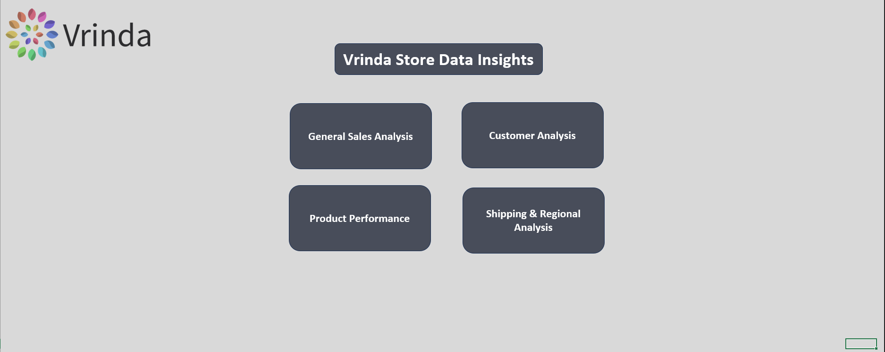

# Vrinda Store Sales Dashboard

## Overview
This *Interactive Sales Dashboard* is built using *Microsoft Excel* to analyze and visualize sales transactions from the Vrinda Store dataset. The dashboard provides insights into customer demographics, sales trends, product categories, and order statuses.

## Features
- *Dynamic Filtering*: Users can filter data by month, gender, category, and location.
- *Sales Performance Analysis*: Tracks total orders, revenue, and successful deliveries.
- *Customer Demographics*: Analyzes purchases based on age groups and gender.
- *Product Insights*: Identifies top-selling products and categories.
- *Shipping & Regional Analysis*: Examines sales distribution across different locations.

## Charts & Visuals
1. *General Sales Analysis*: Provides an overview of total transactions and revenue.
2. *Monthly Sales Trends*: Displays sales performance over different months.
3. *Customer Demographics*: Gender-based and age-group distribution of customers.
4. *Order Status Breakdown*: Percentage of delivered, canceled, and returned orders.
5. *Top Product Categories*: Highlights best-selling product categories.
6. *Regional Sales Performance*: Maps sales data to different states and cities.

## Insights
- *High Sales in December*: The dataset indicates a peak in orders during December.
- *Women Dominate Purchases*: The majority of customers are women.
- *Popular Categories*: Kurta and Set categories are among the best-selling items.
- *Regional Trends*: High sales concentration in cities like Gurgaon and Kolkata.

## Screenshot

---
This dashboard is perfect for tracking sales performance, identifying key trends, and making data-driven business decisions. 🚀
